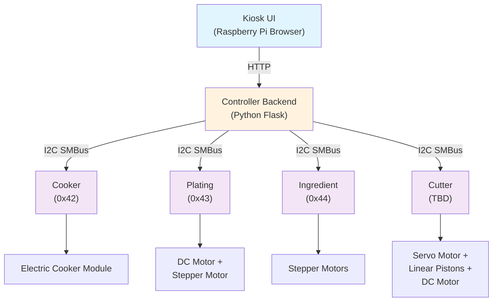
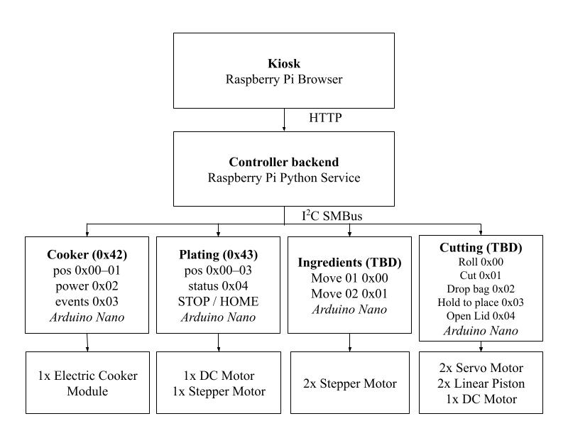
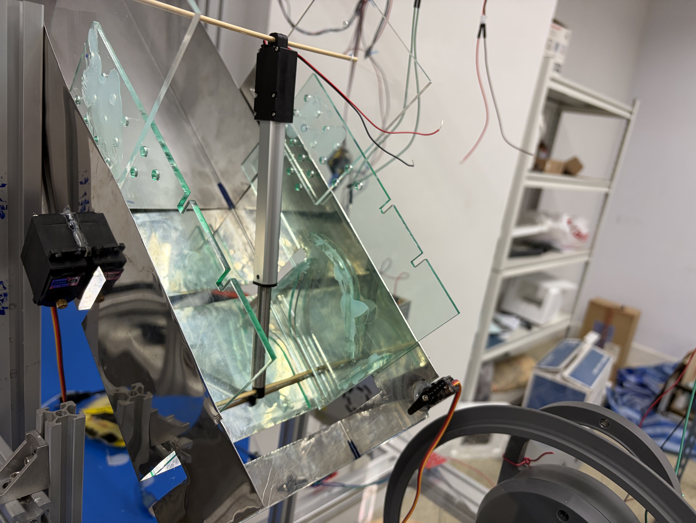
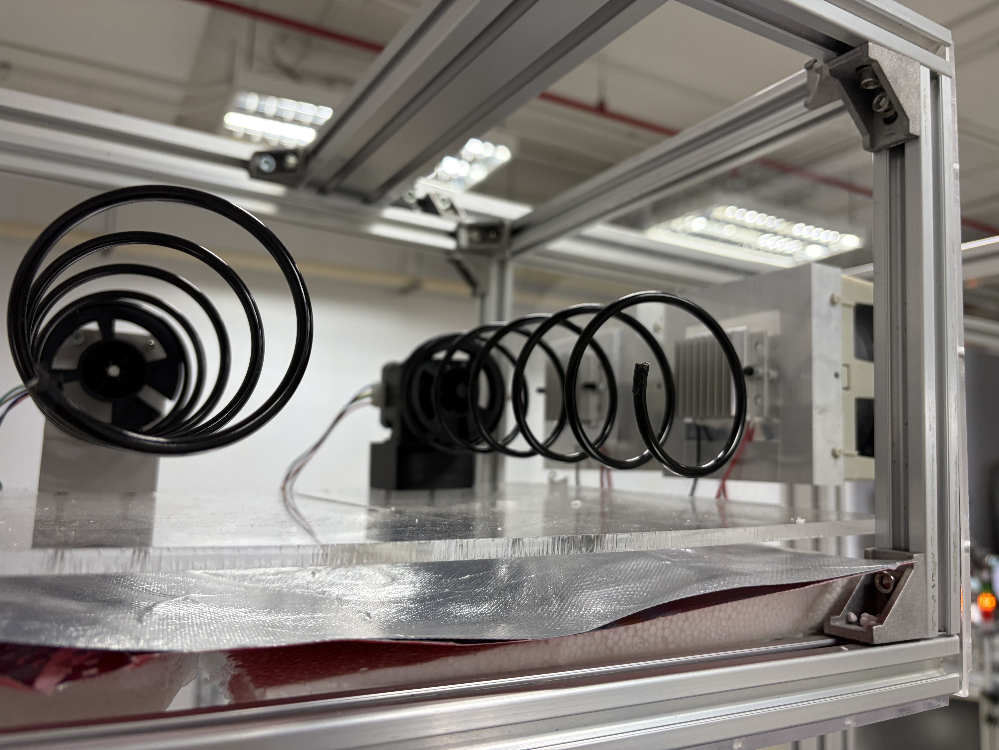
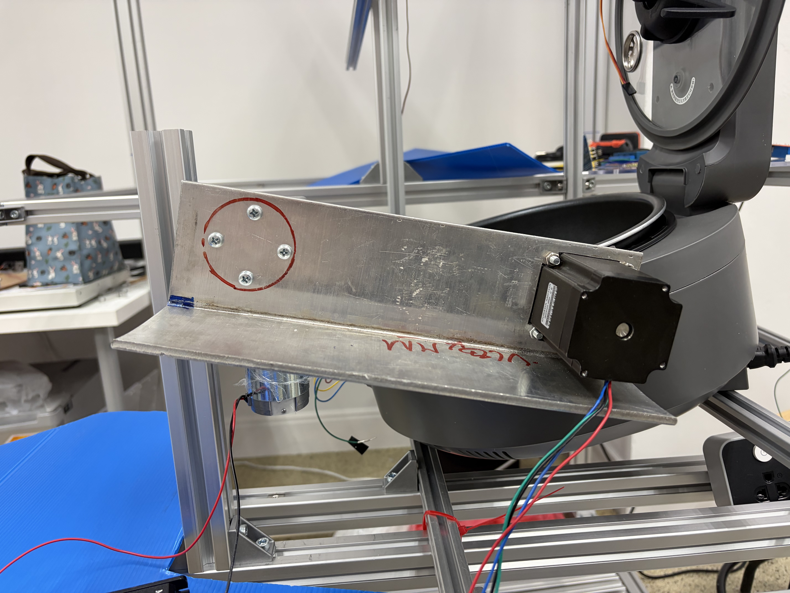
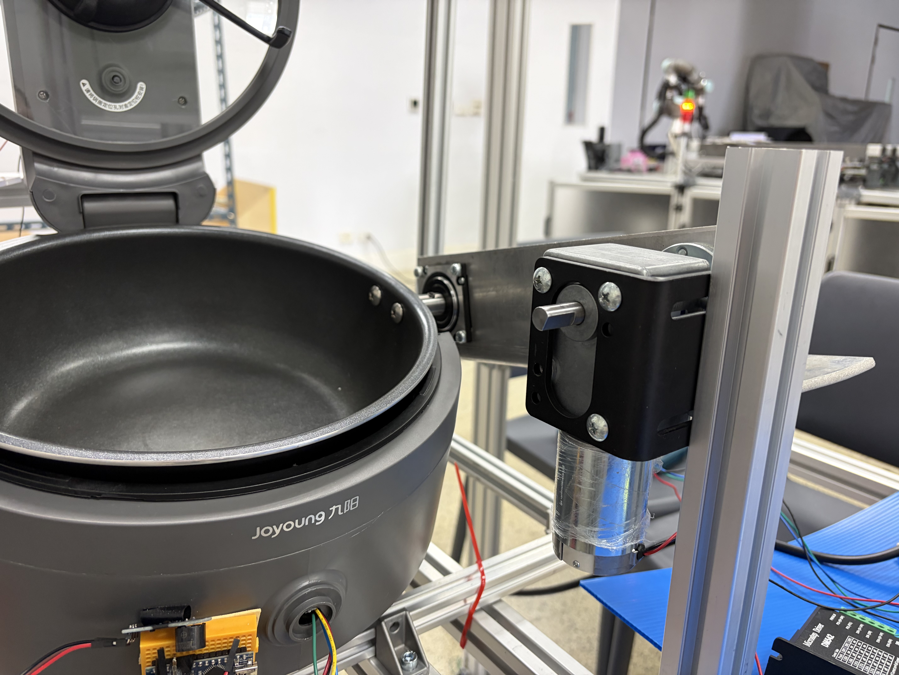

# Robo Cooker

Senior Project for Robotics and Artificial Intelligence Engineering.

## System Architecture



### Components

| Layer        | Technology                  | Role                                      |
| ------------ | --------------------------- | ----------------------------------------- |
| **UI**       | React Router 7 (TypeScript) | Web interface for order customization     |
| **Backend**  | Python Flask                | I2C controller API; device communication  |
| **Devices**  | Arduino Nano × 4            | I2C-enabled firmware for hardware control |
| **Hardware** | Motors, sensors, relays     | Physical cooking and plating apparatus    |

## Arduino Firmware (nodes)

Uses [PlatformIO](https://platformio.org/). Install it once with:

```bash
pipx install platformio
```

Then for any node (`cooker`, `plating`, `ingredient`, `cutter`):

```bash
cd nodes/<node>
pio run                  # compile
pio run -t upload        # flash to Arduino Nano via USB
pio device monitor       # serial monitor at 115200 baud
```

---

## Deployment

Run once to install systemd services and kiosk mode on the Pi:

```bash
./deploy.sh --setup [rpi-host]   # default host: rpi
```

Subsequent deploys (sync + build + restart):

```bash
./deploy.sh [rpi-host]
```

**Pi prerequisites (done once manually):**

```bash
sudo apt install -y python3-venv nodejs npm chromium-browser unclutter
sudo raspi-config   # Interface Options → I2C → Enable
```

### Services

| Service          | What it runs                               | Port |
| ---------------- | ------------------------------------------ | ---- |
| `tastebox-api`   | Flask controller API (`controller/api.py`) | 5000 |
| `tastebox-web`   | React Router web UI (`react-router-serve`) | 3000 |
| `tastebox-kiosk` | Chromium in kiosk mode → `localhost:3000`  | —    |

### Log tailing

```bash
ssh rpi 'journalctl -u tastebox-api    -f'
ssh rpi 'journalctl -u tastebox-web    -f'
ssh rpi 'journalctl -u tastebox-kiosk  -f'
```

---

## Hardware

### System Diagram


_Full system wiring and control architecture_

### Cutting Mechanism


_Cutter assembly with lid opener and linear pistons_

### Ingredient Coil


_Stepper motor-driven coil for ingredient dispensing_

### Serving


_Plating arm delivering food to the serving position_


_Alternate view of the serving sequence_
